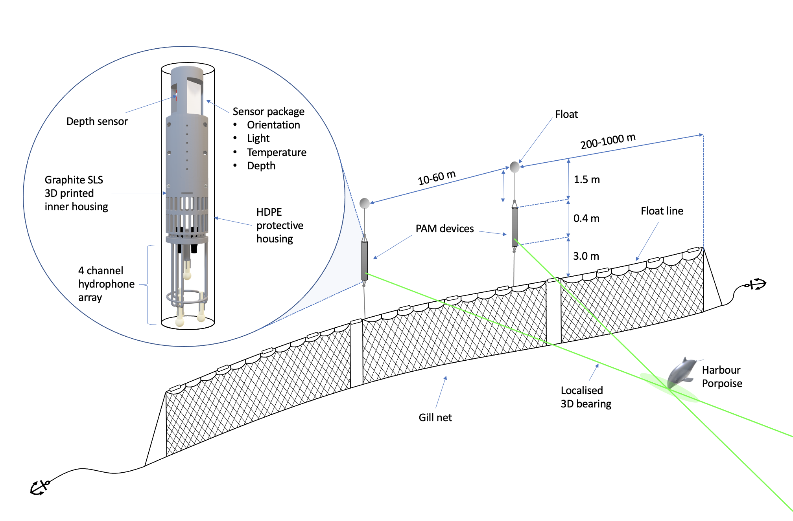
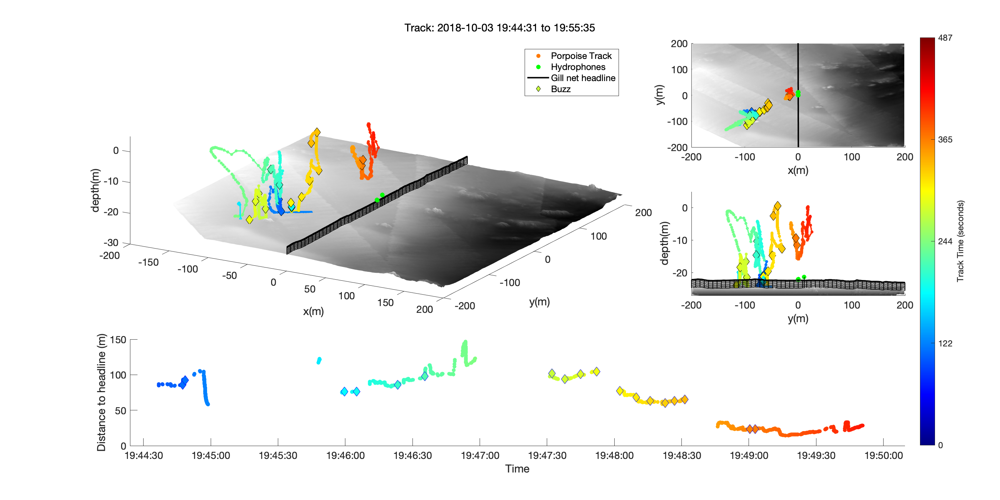

# SoundNet

## Introduction

Bycatch (accidental entanglement in fishing gear) is by far the greatest cause of anthropogenic mortality in toothed whales (sperm whales, dolphins, porpoise, beaked whales and river dolphins), with hundreds of thousands estimated killed each year. This enormous mortality means bycatch is an acute welfare and conservation issue which has led to large population declines and the likely extinction of at least one species and possibly two others in the near future (vaquita and Maui’s dolphin). Despite bycatch being one of the top conservation concerns for many toothed whale species, we do not know why seemingly highly intelligent animals with sophisticated sensory abilities get entangled in nets.

The reason for this knowledge gap is primarily because it's very difficult to study behaviour underwater. Video cameras cannot see more than a few meters and tagging dolphins and porpoises is very difficult and may not provide the required data. However, all toothed whales studied so far produce echolocation clicks to hunt and sense their surroundings. These clicks (and other sounds) can be detected on acoustic recorders allowing large areas of the ocean to be monitored. Whilst passive acoustic monitoring (PAM) is oten used to detect the presence and classify the species of toothed whales in an area, in certain configurations acoustic recorder can also be used to localise the position of animals. 

SoundNet is an open-source hardware and software system for localising the position of dolphins and porpoises around fishing gear, particularly focussed on gill nets (which cause the most bycatch by far). It allows dolphins and porpoises to be tracked in 3D around nets allowing both their movement and acoustic behaviour to be studied and providing insights into how animals interact with nights (and thus provide some explanation on how they might become entangled). SoundNet can be deployed from almost any fishing vessel and this provides a powerful and highly practical tool for studying the beahviour of toothed whales. 

## Concept 

SoundNet has a relatively simple concept. Two recorders which can work out the geo-referenced bearing to a received click are deployed on the headline of gill net separated by 20-50m. If two devices detect the same click, then the point at which the bearings cross is the position of the animal (see Figure 1). 

  

_Figure 1. Diagram of the localising array (not to scale). Two recording devices were attached to the floatline of a gill net via a 3 m strop line. The recording devices were kept slightly positively buoyant using a small float, allowing them to maintain position in the water column above the float line without deforming the net. Each device contained a tetrahedral 4 element hydrophone cluster which enabled the calculation of 3D localisation vector to the source of a received sound. As a given deployment involved two devices, there was effectively an 8-channel hydrophone array mounted on the net. If both devices detected the same click, the point at which the two vectors intersected indicated the instantaneous 3D location of the animal. Animal movement patterns could then be inferred by interpolating these 3D locations._

However, whilst the concept is straightforward the implementation requires several components. 

1)	A recorder which can work out a bearing to a receiver requires multiple synchronised hydrophones. The system is based on a 4 channel SoundTrap which can be ordered from www.oceaninstrument.com. The housing section of the repository contains designs to 3D print a housing which attaches the SoundTrap and holds 4 hydrophones in a tetrahedral configuration
2)	Although multiple hydrophones can provide a bearing to an animal, the bearing needs to be georeferenced (i.e. referenced from north) for acoustic localisation to be possible. This requires an additional sensor packaged which attaches to the rear port of the SoundTrap and provides accurate 3D orientation, depth, temperature and light measurements. The sensor package section provides housing, electronic and firmware for the sensor package.
3)	Although bearings are a good way to conceptualise how the system works, they are not a great way to localise animals positions. A localization algorithm based on time delay measurements between the hydrophones and a particle filter provides much more accurate 3D tracks. The software workflow to analyse the acoustic data from SoundNet devices is detail in the analysis section.  

## Data

The resulting data from a successfully deployed system and analysis provides 3D tracks of animals which can be cross referenced with acoustic behaviour, for example tell-tale foraging buzzes. Figure 2 shows an example of 3D tracks of harbour porpoises around the net. 

  
</p
  
_Figure 2. Example of a 3D dive track of a single harbour porpoise where the porpoise approaches but does not come within 5 m of the gill net. A) A 3D view of the track, including bathymetry and the position of the gill net (black). Note that the gill net was assumed to be in line with the recording devices and  2m above the seabed.   B) A top-down view, and C) the depth profile along the gill net. . In this example, the porpoise dives close to the net several times producing foraging buzzes (or possibly calls) throughout the water column and towards the end of the encounter comes very close (< 5 m) to the net._

## License

This project is fully open source and any component can be used by anyone as long as it’s credited properly. We provide no guarantees and may not provide support without prior agreement.  

