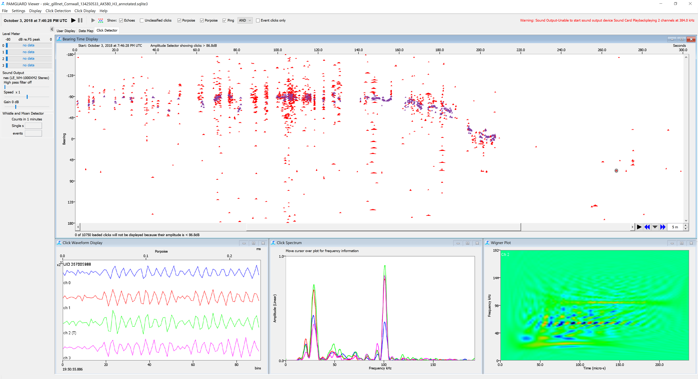
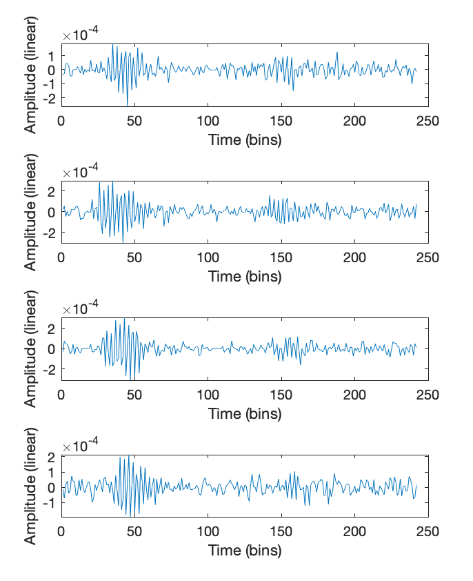
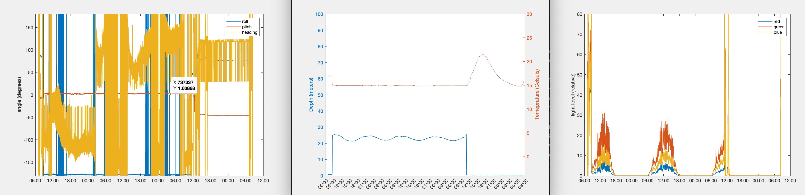
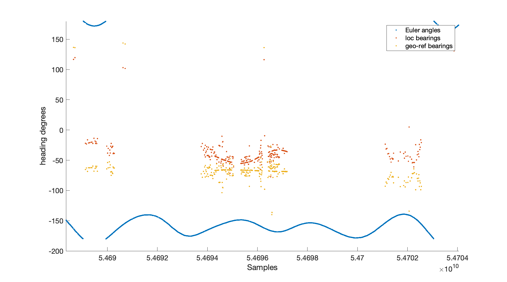
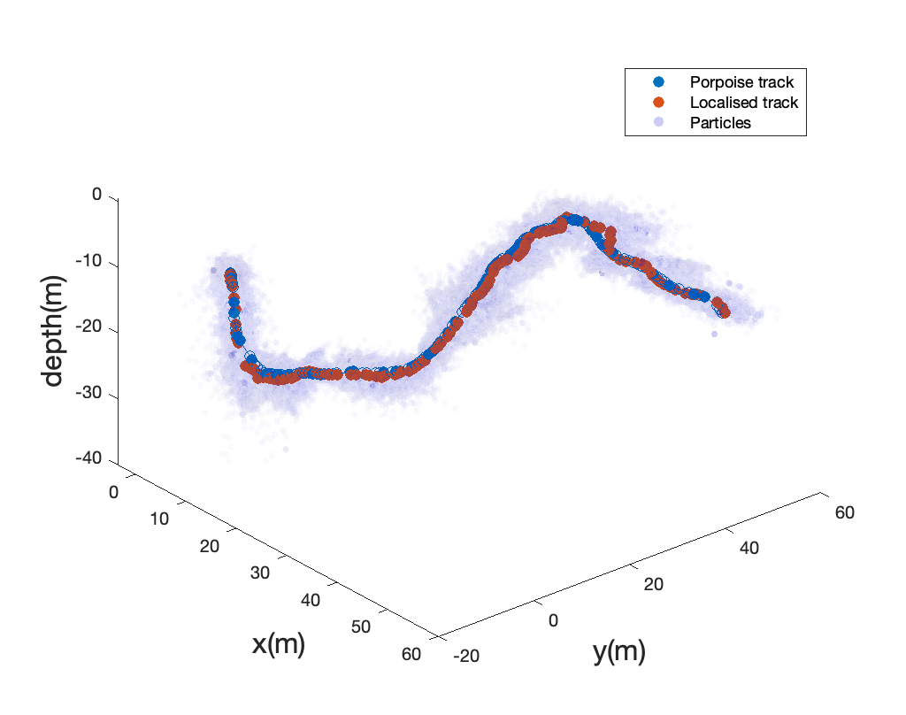

# Acoustic Analysis

SoundNet data consist of two or more (if more devices are used) sets of 4 channel wave files and sensor package files. 

## Acoustic data

### Analysis in PAMGuard

The acoustic data is analysed in PAMGuard to detect and classify possible porpoise clicks. A manual analyst then verifies detections using PAMGuard's manual annotation tools to mark out click trains and remove spurious detections (e.g. echoes). Detected clicks along with metadata such as bearing and time delays are saved to bespoke PAMGaurd files (PAMGaurd binary files) which can be imported into MATLAB using the [MATLAB to PAMGuard library](https://github.com/PAMGuard/PAMGuardMatlab) (note: you must download this library and add it to your MATLAB path). 

<p align="center">
  
</p>

_An example of clicks detected on one SoundNet device. PAMGuard automatically matched clicks on different hydrophones (on the same device, not between devices) and calculated the time delays, horizontal and vertical bearings. A manual analyst can use the slowly changes bearings to mark out click trains in the bearing time display. If more than one animal is present there will usually be concurrent separated bearing tracks._ 

### PAMGuard MATLAB library

Opening a PAMGuard binary file is straightforward. For example, a folder of binary files can be opened via

```Matlab
%the folder
folder = 'rootpath\mypamguardfolder'; 

% load clicks
clicks = loadPamguardBinaryFolder(folder, 'Click_Detector_Clicks_*.pgdf', 5);
```
This will return an array of clicks, with each element a structure containing metadata for each click such as time, waveform, time delays, bearings (if multiple hydrophones). The data can be explored in MATLAB's variable explorer or accessed via code. For example, to extract the time delay values from the first clicks in the array use 

```Matlab
timedelays = clicks(1).delays
````
The time delays are measured between all hydrophones - so for four hydrophones there are six measurements - i.e. the time delays between channels 0 - 1,  0 - 2,  0 - 3,  1 - 2,  1 - 3 and 2 - 3. 

Waveforms from a click detection can be plotted using 

```Matlab
%waveform of the first click 
wave = clicks(1).wave

tiledlayout(1,clicks(1).nChan)
for i = 1:nChan
  nexttile
  plot(wave); 
  ylabel('Amplitude (linear)')
  xlabel('Time (bins)')
end
````

<p align="center">
  
</p>

_An example of waveforms from a single click detection imported from PAMGuard and plotted using MATLAB. Note that PAMGuard automatically matched click between hydrophones within the same SoundNet device and so one click detection contains 4 waveforms. PAMGuard also calculates the time delays between the waveforms and localised the horizontal and vertical bearing for each click_

Note that there is also a [comprehensive R library](https://github.com/TaikiSan21/PamBinaries) for PAMGuard which has like-for-like functions to the MATLAB library. 

### Importing datasets

The matlab library has several convenience functions for importing large datasets. For example,

```Matlab
% load clicks from a folder
% binaryfolder - path to the folder containinn PAMGuard binary files
clicks = loadPamguardBinaryFolder(binaryfolder, 'Click_Detector_Clicks_*.pgdf', 5);
```
will load clicks from a folder of binary files and 

```Matlab
% sqlLite_dB - path to PAMGuard's database
% binaryfolder - path to the folder containinn PAMGuard binary files
click_events = load_event_clicks( sqlLite_dB, binaryfolder)
```

will load manually annotated clicks marked out in the click detector module. 


## Sensor files

Sensor files from the sensor package attached to the SoundTrap are human readable .csv files which are saved to the SoundTrap's SD card. These can be opened using the MATLAB code in the sensor package folder. For example, to open a folder of sensor files and plot the data use

```Matlab
%folder where the csv files are located. 
folder = 'rootpath\mysensorfolder'; 

% convert csv files to one matlab struct
[sensordata] = sensorcsv2mat(csvfolder);

%plot the sensor data
plot_sensor_data(sensordataStruct); 
```

The sensordata struct contains the output from the orientation, depth, temperature, light and battery sensors on the sensor package 

<p align="center">
  
</p>

_Example of sensor package data plotted in MATLAB._

## Geo referencing hydrophones and/or localised bearings

The sensor data is used to geo-reference clicks. The _sensordata_ folder imports .csv files and concatonates the sensor data into a single matlab structure. The functions in the _georef_ folder then combine imported click detections and the sensordata to provide geo-referenced bearings and/or hydrophone positions. aan example of how to use the functions is shown in georef/georef_example.m

<p align="center">
  
</p>

_A plot of raw and georeferenced bearings to detected porpoise clicks alongisde the heading data recorded on the sensor package._


## Localisation

Localisation is performed using a particle filter. A particle filter in this context works by updated the position of a set of particles upon the detection of a click on one or more recording devices. The particles are updated based on the position of the hydrophones, the received time delays and movement model of a harbour porpoise. In this way localisation is not based on single clicks but instead on the evolved state of click trains, allowing more accurate animal tracks t be determined.

The generalised particle filter code is based on a script by  _Diego Andrés Alvarez Marín (2022). Particle filter tutorial (https://www.mathworks.com/matlabcentral/fileexchange/35468-particle-filter-tutorial), MATLAB Central File Exchange._

example_porpoise.m demonstrates how the particle filter is used in an acoustic localisation context. The script generates a simulated porpoise track, determine the time delays for clicks produced along the track and then localises the simulated track using a particle filter. 


<p align="center">
  
</p>

_Results of the particle filter using the porpoise_example.m script. The orange points are the localised positions and the blue dots the simulated animal track. The cloud of translucent points are the individual particles used by the sequential Monte Carlo process. The mean location of particles is the position of the animal and the distribution of particles is an estimate of the likely uncertainty. For example the distribution of particles in the x,y or z dimensions represents the likely error of the localisation in  x,y and z respectively._


## Data management

Data management will vary depending on the project and thus data management code is not provided here; the code provided and associated help should be considered a toolbox to construct an acoustic workflow for localisation, rather than a one-stop solution. 

However, whilst each acoustic workflow will depend on the study site, species of interest etc., they will all require some general stages as follows. 

1) Extract sounds of interest.
3) Geo reference hydrophone positons using the sensor package data.
4) Time align the SoundTraps and match clicks between different devices. 
5) Pass time aligned and geo-referenced data to the localisation algorithm to determine animal tracks. 
