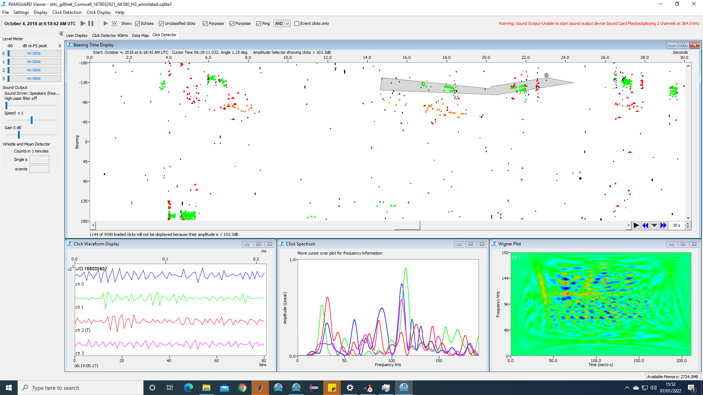

# Acoustic Analysis

SoundNet data consist of two or more (if more devices are used) sets of 4 channel wave files and sensor package files. 

## Acoustic data

The acoustic data is analysed in PAMGuard to detect and classify possible porpoise clicks. A manual analyst then verifies detections using PAMGuard's manual annotation tools to mark out click trains and remove spurious detections (e.g echoes). Detected clicks along with metadata sich as bearing and time delays are saved to bespoke PAMGaurd files (PAMGaurd binary files) which can be imported into MATLAB using the [MATLAB to PAMGuard library](https://github.com/PAMGuard/PAMGuardMatlab) (note: you must download this library and add it to your MATLAB path). 

<p align="center">
  
</p>

Opening a PAMGuard binary file is easy. For example a folder of binary files can be opened via


## Sensor files

Sensor files from the sensor package attached to the SoundTrap are human readable .csv files saved to the SoundTrap's SD card. These can be opened using the MATLAB code in the sensor package folder. For example to open a folder of sensor files and plot the data use

```Matlab
%folder where the csv files are located. 
folder = 'rootpath\mysensorfolder'; 

% convert csv files to one matlab struct
[sensordata] = sensorcsv2mat(csvfolder);

%plot the sensor data
plot_sensor_data(sensordataStruct); 
```

The sensordata struct contains the output from the orientation, depth, temperature, light and battery sensors on the sensor package 

<p align="center">
  
</p>

_Example of sensor package data plotted in MATLAB._


## Localisation

Localisation is performed 
